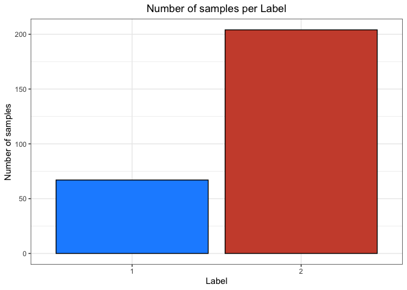
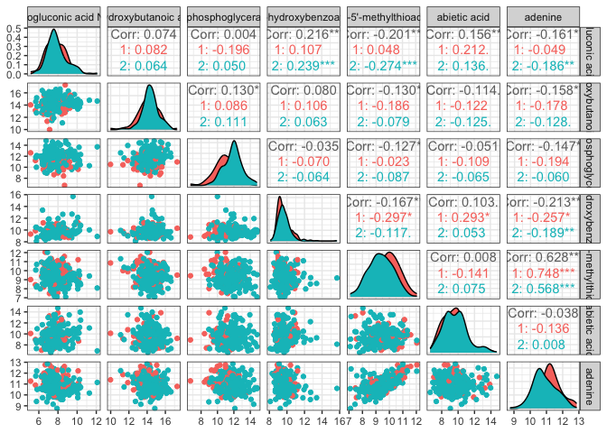
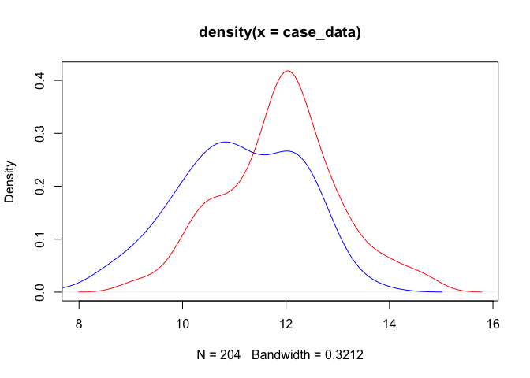
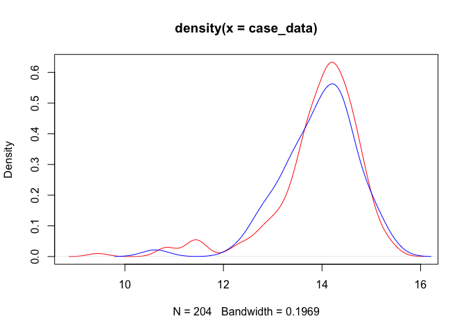

Pre-processing & Feature Selection on BREAST Data
================

### Load libraries

``` r
library(stringr)
library(dplyr)
library(ggplot2)
library(GGally)
library(dgof)#install.packages("dgof")
```

### Load data

We load raw data from the article of Budczies *et al*
(<https://doi.org/10.1016/j.jprot.2013.10.002>).

``` r
data = read.csv("Metabolomic_project/breast_project/data/BREAST_raw.csv", sep = ";")
t_data = t(data)
colnames(t_data) <- data[, 1]
breast_data = t_data[-c(1), ]
# Remove row names
rownames(breast_data) <- NULL
dim(breast_data)
```

    ## [1] 271 163

The data concern **breast cancer** and are composed of **271 patients**
and **163 metabolites**.

# Modifications of data

### 1. Convert to numeric

``` r
breast_data <- as.data.frame(apply(breast_data, 2, function(x) as.numeric(x)))
```

### 2. Have a look on data

``` r
breast_data %>%
  mutate(Label = factor(Label)) %>%
  ggplot(aes(x=Label, fill=Label)) +
  geom_bar(stat="count", col = "black", show.legend = F) +
  scale_fill_manual(values = c("dodgerblue", "tomato3")) +
  labs(y = "Number of samples", title = "Number of samples per Label") +
  theme_bw() +
  theme(plot.title = element_text(hjust = 0.5))
```

<!-- -->

**Labels 1** correspond to samples with **ER- tumors** (n=67).<br>
**Labels 2** correspond to samples with **ER+ tumors** (n=204).

Data are very unbalanced, we have more ER+ tumors than ER- tumors.

``` r
ggpairs(as.data.frame(breast_data), columns = 12:18, ggplot2::aes(colour=as.character(breast_data[, 1]))) + theme_bw()
```

<!-- -->

### 3. Transform target from 1/2 to 0/1

``` r
# Case: 2 >> 1 | Control: 1 >> 0
if (sum(breast_data[, 1] == 0) == 0) breast_data[, 1] = breast_data[, 1] - 1
# Look at first 5 rows
breast_data[1:5, 1]

# write.csv(breast_data, "Metabolomic_project/breast_project/data/BREAST_T.ALL.Feat.csv", row.names = F)
```

    ## [1] 0 0 0 0 0

Now, **labels 0** correspond to samples with **ER- tumors** (n=67) and
**labels 1** correspond to samples with **ER+ tumors** (n=204).

# Feature selection

Next, we want to reduce the number of features to see whether or not
this improves sample classification.<br> To do this, we chose the
Kolmogorov-Smirnov (KS) test to compare distribution of both populations
for each feature (metabolite).

``` r
Nb_features = NCOL(breast_data)
selected_features = c()
meta_pValues = rep(NA, 2)
#
target = "Label"
#
for (meta in 2:Nb_features){
  metabolite_data = breast_data[, meta]
  case_data = metabolite_data[breast_data[,target] == 1]
  control_data = metabolite_data[breast_data[,target] == 0]
  #Run KS test
  ks_result = ks.test(case_data, control_data, exact=FALSE)
  if (ks_result$p.value <= 0.05){ # keep the 200 significant p-value
    # Sufficient evidence to say that the two sample datasets do not come from the same distribution: so we keep the metabolite
    selected_features = c(selected_features, meta)
  }
  # Store the p.values
  meta_pValues[meta-1] = ks_result$p.value
}
```

### 2. Select all significative different features

We select only features with a pvalue \<= 0.05.

``` r
length(selected_features)
kept_feat <- selected_features
```

    ## [1] 52

In total, we have selected **52** of the 163 original features.

### 3. Have a look on selected features

``` r
set.seed(1)
meta = sample(kept_feat, 1) # Pick a feature
metabolite_data = breast_data[, meta]
case_data = metabolite_data[breast_data[,target] == 1]
control_data = metabolite_data[breast_data[,target] == 0]
plot(density(case_data), col="red") 
lines(density(control_data), col="blue")
```

<!-- -->

``` r
metabolite_data = breast_data[, 5]
case_data = metabolite_data[breast_data[,target] == 1]
control_data = metabolite_data[breast_data[,target] == 0]
plot(density(case_data), col="red") 
lines(density(control_data), col="blue")
```

<!-- -->

### 4. Save the results

``` r
sub_feat_breast_data = cbind(Label=breast_data[,1], breast_data[, kept_feat])
dim(sub_feat_breast_data)
#write.csv(sub_feat_breast_data, "Metabolomic_project/breast_project/data/BREAST_T.Feat.Select.csv", row.names = F)
```

    ## [1] 271  53
